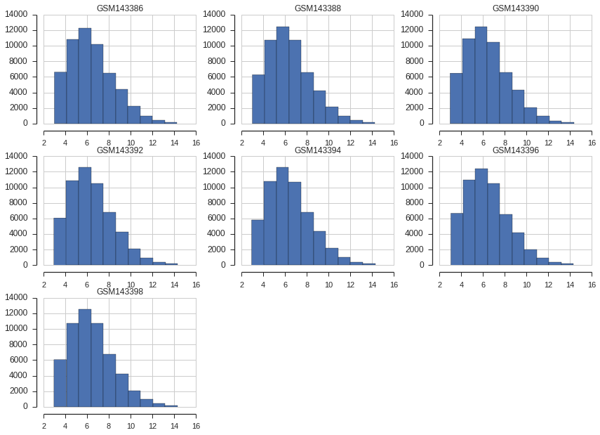
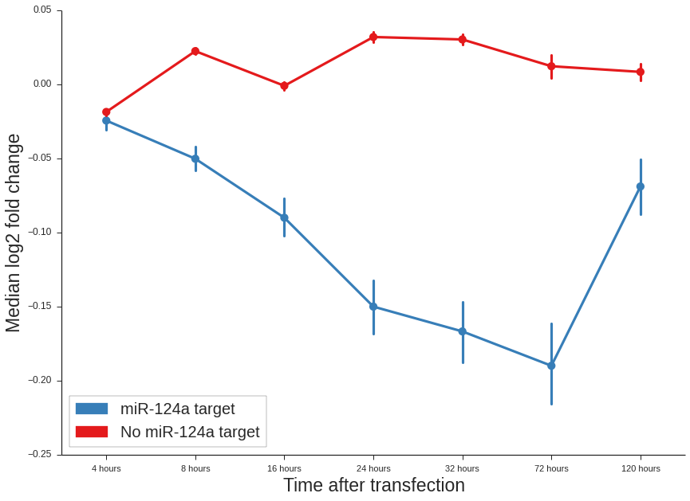

Analyse hsa-miR-124a-3p transfection time-course
------------------------------------------------

.. note::
    In order to do this analysis you have to be in the tests directory of
    GEOparse.

In the paper *Systematic identification of microRNA functions by
combining target prediction and expression profiling* Wang and Wang
provided a series of microarrays from 7 time-points after miR-124a
transfection. The series can be found in GEO under the GSE6207
accession. We use this series to demonstrate general principles of
GEOparse.

.. warning::
    Mind that this tutorial is not abut how to properly calculate
    log fold changes - the approach undertaken here is simplistic.

We start with the imports:

.. code:: python

    import GEOparse
    import pandas as pd
    import pylab as pl
    import seaborn as sns
    pl.rcParams['figure.figsize'] = (14, 10)
    pl.rcParams['ytick.labelsize'] = 12
    pl.rcParams['xtick.labelsize'] = 11
    pl.rcParams['axes.labelsize'] = 23
    pl.rcParams['legend.fontsize'] = 20
    sns.set_style('ticks')
    c1, c2, c3, c4 = sns.color_palette("Set1", 4)

Now we select the GSMs that are controls. See below on how to generate names
of control samples directly from the phenotype data of GSE.

.. code:: python

    controls = ['GSM143386',
                'GSM143388',
                'GSM143390',
                'GSM143392',
                'GSM143394',
                'GSM143396',
                'GSM143398']

Using GEOparse we can download experiments and look into the data:

.. code:: python

    gse = GEOparse.get_GEO("GSE6207")

.. parsed-literal::

    File already exist: using local version.
    Parsing ./GSE6207.soft.gz:
     - DATABASE : GeoMiame
     - SERIES : GSE6207
     - PLATFORM : GPL570
     - SAMPLE : GSM143385
     - SAMPLE : GSM143386
     - SAMPLE : GSM143387
     - SAMPLE : GSM143388
     - SAMPLE : GSM143389
     - SAMPLE : GSM143390
     - SAMPLE : GSM143391
     - SAMPLE : GSM143392
     - SAMPLE : GSM143393
     - SAMPLE : GSM143394
     - SAMPLE : GSM143395
     - SAMPLE : GSM143396
     - SAMPLE : GSM143397
     - SAMPLE : GSM143398

The GPL we are interested:

.. code:: python

    gse.gpls['GPL570'].columns

.. raw:: html

    

    <table border="1" class="dataframe">
      <thead>
        <tr style="text-align: right;">
          <th></th>
          <th>description</th>
        </tr>
      </thead>
      <tbody>
        <tr>
          <th>ID</th>
          <td> Affymetrix Probe Set ID LINK_PRE:"https://www....</td>
        </tr>
        <tr>
          <th>GB_ACC</th>
          <td> GenBank Accession Number LINK_PRE:"http://www....</td>
        </tr>
        <tr>
          <th>SPOT_ID</th>
          <td>                               identifies controls</td>
        </tr>
        <tr>
          <th>Species Scientific Name</th>
          <td> The genus and species of the organism represen...</td>
        </tr>
        <tr>
          <th>Annotation Date</th>
          <td> The date that the annotations for this probe a...</td>
        </tr>
        <tr>
          <th>Sequence Type</th>
          <td>                                                  </td>
        </tr>
        <tr>
          <th>Sequence Source</th>
          <td> The database from which the sequence used to d...</td>
        </tr>
        <tr>
          <th>Target Description</th>
          <td>                                                  </td>
        </tr>
        <tr>
          <th>Representative Public ID</th>
          <td> The accession number of a representative seque...</td>
        </tr>
        <tr>
          <th>Gene Title</th>
          <td>       Title of Gene represented by the probe set.</td>
        </tr>
        <tr>
          <th>Gene Symbol</th>
          <td> A gene symbol, when one is available (from Uni...</td>
        </tr>
        <tr>
          <th>ENTREZ_GENE_ID</th>
          <td> Entrez Gene Database UID LINK_PRE:"http://www....</td>
        </tr>
        <tr>
          <th>RefSeq Transcript ID</th>
          <td> References to multiple sequences in RefSeq. Th...</td>
        </tr>
        <tr>
          <th>Gene Ontology Biological Process</th>
          <td> Gene Ontology Consortium Biological Process de...</td>
        </tr>
        <tr>
          <th>Gene Ontology Cellular Component</th>
          <td> Gene Ontology Consortium Cellular Component de...</td>
        </tr>
        <tr>
          <th>Gene Ontology Molecular Function</th>
          <td> Gene Ontology Consortium Molecular Function de...</td>
        </tr>
      </tbody>
    </table>
    

|

And the columns that are available for exemplary GSM:

.. code:: python

    gse.gsms["GSM143385"].columns

.. raw:: html

    

    <table border="1" class="dataframe">
      <thead>
        <tr style="text-align: right;">
          <th></th>
          <th>description</th>
        </tr>
      </thead>
      <tbody>
        <tr>
          <th>ID_REF</th>
          <td>                           Affymetrix probe set ID</td>
        </tr>
        <tr>
          <th>VALUE</th>
          <td> RMA normalized Signal intensity (log2 transfor...</td>
        </tr>
      </tbody>
    </table>
    

|

We take the opportunity and check if everything is OK with the control
samples. For this we just use simple histogram. To obtain table with
each GSM as column, ID\_REF as index and VALUE in each cell we use
pivot\_samples method from GSE object (we restrict the columns to the
controls):

.. code:: python

    pivoted_control_samples = gse.pivot_samples('VALUE')[controls]
    pivoted_control_samples.head()

.. raw:: html

    

    <table border="1" class="dataframe">
      <thead>
        <tr style="text-align: right;">
          <th>name</th>
          <th>GSM143386</th>
          <th>GSM143388</th>
          <th>GSM143390</th>
          <th>GSM143392</th>
          <th>GSM143394</th>
          <th>GSM143396</th>
          <th>GSM143398</th>
        </tr>
        <tr>
          <th>ID_REF</th>
          <th></th>
          <th></th>
          <th></th>
          <th></th>
          <th></th>
          <th></th>
          <th></th>
        </tr>
      </thead>
      <tbody>
        <tr>
          <th>1007_s_at</th>
          <td> 9.373339</td>
          <td> 9.316689</td>
          <td> 9.405605</td>
          <td> 9.332526</td>
          <td> 9.351024</td>
          <td> 9.245251</td>
          <td> 9.423234</td>
        </tr>
        <tr>
          <th>1053_at</th>
          <td> 8.453839</td>
          <td> 8.440368</td>
          <td> 8.435023</td>
          <td> 8.411635</td>
          <td> 8.373939</td>
          <td> 8.082178</td>
          <td> 7.652785</td>
        </tr>
        <tr>
          <th>117_at</th>
          <td> 5.878466</td>
          <td> 5.928938</td>
          <td> 5.969288</td>
          <td> 5.984232</td>
          <td> 5.882761</td>
          <td> 5.939399</td>
          <td> 6.027338</td>
        </tr>
        <tr>
          <th>121_at</th>
          <td> 9.131430</td>
          <td> 9.298601</td>
          <td> 9.176132</td>
          <td> 9.249977</td>
          <td> 9.149849</td>
          <td> 9.250952</td>
          <td> 9.352397</td>
        </tr>
        <tr>
          <th>1255_g_at</th>
          <td> 3.778179</td>
          <td> 3.861210</td>
          <td> 3.740103</td>
          <td> 3.798814</td>
          <td> 3.761673</td>
          <td> 3.790185</td>
          <td> 3.895462</td>
        </tr>
      </tbody>
    </table>
    

|

And we plot:

.. code:: python

    pivoted_control_samples.hist()
    sns.despine(offset=10, trim=True)

Next we would like to filter out probes that are not expressed. The gene
is expressed (in definition here) when its average log2 intensity in
control samples is above 0.25 quantile. I.e. we filter out worst 25%
genes.

.. code:: python

    pivoted_control_samples_average = pivoted_control_samples.median(axis=1)
    print("Number of probes before filtering: ", len(pivoted_control_samples_average))

.. parsed-literal::

    Number of probes before filtering:  54675

.. code:: python

    expression_threshold = pivoted_control_samples_average.quantile(0.25)

.. code:: python

    expressed_probes = pivoted_control_samples_average[pivoted_control_samples_average >= expression_threshold].index.tolist()
    print("Number of probes above threshold: ", len(expressed_probes))

.. parsed-literal::

    Number of probes above threshold:  41006

We can see that the filtering succeeded. Now we can pivot all the
samples and filter out probes that are not expressed:

.. code:: python

    samples = gse.pivot_samples("VALUE").ix[expressed_probes]

The most important thing is to calculate log fold changes. What we have
to do is for each time-point identify control and transfected sample and
subtract the VALUES (they are provided as log2 transformed already, we
subtract transfection from the control).

In order to identify control and transfection samples we will take a look into
phenotype data and based on it we decide how to split samples:

.. code-block:: python

    print gse.phenotype_data[["title", "source_name_ch1"]]

.. parsed-literal::

                                                     title  source_name_ch1
    GSM143385             miR-124 transfection for 4 hours  HepG2 cell line
    GSM143386    negative control transfection for 4 hours  HepG2 cell line
    GSM143387             miR-124 transfection for 8 hours  HepG2 cell line
    GSM143388    negative control transfection for 8 hours  HepG2 cell line
    GSM143389            miR-124 transfection for 16 hours  HepG2 cell line
    GSM143390   negative control transfection for 16 hours  HepG2 cell line
    GSM143391            miR-124 transfection for 24 hours  HepG2 cell line
    GSM143392   negative control transfection for 24 hours  HepG2 cell line
    GSM143393            miR-124 transfection for 32 hours  HepG2 cell line
    GSM143394   negative control transfection for 32 hours  HepG2 cell line
    GSM143395            miR-124 transfection for 72 hours  HepG2 cell line
    GSM143396   negative control transfection for 72 hours  HepG2 cell line
    GSM143397           miR-124 transfection for 120 hours  HepG2 cell line
    GSM143398  negative control transfection for 120 hours  HepG2 cell line

We can see that based on the title of the experiment we can get all the
information that we need:

.. code-block:: python

    experiments = {}
    for i, (idx, row) in enumerate(gse.phenotype_data.iterrows()):
        tmp = {}
        tmp["Experiment"] = idx
        tmp["Type"] = "control" if "control" in row["title"] else "transfection"
        tmp["Time"] = re.search(r"for (\d+ hours)", row["title"]).group(1)
        experiments[i] = tmp
    experiments = pd.DataFrame(experiments).T
    print experiments

.. parsed-literal::

        Experiment       Time          Type
     0   GSM143385    4 hours  transfection
     1   GSM143386    4 hours       control
     2   GSM143387    8 hours  transfection
     3   GSM143388    8 hours       control
     4   GSM143389   16 hours  transfection
     5   GSM143390   16 hours       control
     6   GSM143391   24 hours  transfection
     7   GSM143392   24 hours       control
     8   GSM143393   32 hours  transfection
     9   GSM143394   32 hours       control
     10  GSM143395   72 hours  transfection
     11  GSM143396   72 hours       control
     12  GSM143397  120 hours  transfection
     13  GSM143398  120 hours       control

In the end we create new DataFrame with LFCs:

.. code:: python

    lfc_results = {}
    sequence = ['4 hours',
                 '8 hours',
                 '16 hours',
                 '24 hours',
                 '32 hours',
                 '72 hours',
                 '120 hours']
    for time, group in experiments.groupby("Time"):
        print(time)
        control_name = group[group.Type == "control"].Experiment.iloc[0]
        transfection_name = group[group.Type == "transfection"].Experiment.iloc[0]
        lfc_results[time] = (samples[transfection_name] - samples[control_name]).to_dict()
    lfc_results = pd.DataFrame(lfc_results)[sequence]

.. parsed-literal::

    120 hours
    16 hours
    24 hours
    32 hours
    4 hours
    72 hours
    8 hours

Let's look at the data sorted by 24-hours time-point:

.. code:: python

    lfc_results.sort("24 hours").head()

.. raw:: html

    

    <table border="1" class="dataframe">
      <thead>
        <tr style="text-align: right;">
          <th></th>
          <th>4 hours</th>
          <th>8 hours</th>
          <th>16 hours</th>
          <th>24 hours</th>
          <th>32 hours</th>
          <th>72 hours</th>
          <th>120 hours</th>
        </tr>
      </thead>
      <tbody>
        <tr>
          <th>214149_s_at</th>
          <td> 0.695643</td>
          <td>-0.951014</td>
          <td>-1.768543</td>
          <td>-3.326683</td>
          <td>-2.954085</td>
          <td>-3.121960</td>
          <td>-1.235596</td>
        </tr>
        <tr>
          <th>214835_s_at</th>
          <td>-0.120661</td>
          <td>-1.282502</td>
          <td>-2.540301</td>
          <td>-3.238786</td>
          <td>-3.183429</td>
          <td>-3.284111</td>
          <td>-1.901547</td>
        </tr>
        <tr>
          <th>212459_x_at</th>
          <td> 0.010564</td>
          <td>-1.092724</td>
          <td>-2.235531</td>
          <td>-3.203148</td>
          <td>-3.115878</td>
          <td>-3.008434</td>
          <td>-1.706501</td>
        </tr>
        <tr>
          <th>201171_at</th>
          <td> 0.958699</td>
          <td>-1.757044</td>
          <td>-1.571311</td>
          <td>-3.173688</td>
          <td>-3.061849</td>
          <td>-2.672462</td>
          <td>-1.456556</td>
        </tr>
        <tr>
          <th>215446_s_at</th>
          <td>-0.086179</td>
          <td>-0.408025</td>
          <td>-1.550514</td>
          <td>-3.083213</td>
          <td>-3.024972</td>
          <td>-4.374527</td>
          <td>-2.581921</td>
        </tr>
      </tbody>
    </table>
    

|

We are interested in the gene expression changes upon transfection.
Thus, we have to annotate each probe with ENTREZ gene ID, remove probes
without ENTREZ or with multiple assignments. Although this strategy
might not be optimal, after this we average the LFC for each gene over
probes.

.. code:: python

    # annotate with GPL
    lfc_result_annotated = lfc_results.reset_index().merge(gse.gpls['GPL570'].table[["ID", "ENTREZ_GENE_ID"]],
                                    left_on='index', right_on="ID").set_index('index')
    del lfc_result_annotated["ID"]
    # remove probes without ENTREZ
    lfc_result_annotated = lfc_result_annotated.dropna(subset=["ENTREZ_GENE_ID"])
    # remove probes with more than one gene assigned
    lfc_result_annotated = lfc_result_annotated[~lfc_result_annotated.ENTREZ_GENE_ID.str.contains("///")]
    # for each gene average LFC over probes
    lfc_result_annotated = lfc_result_annotated.groupby("ENTREZ_GENE_ID").median()

We can now look at the data:

.. code:: python

    lfc_result_annotated.sort("24 hours").head()

.. raw:: html

    

    <table border="1" class="dataframe">
      <thead>
        <tr style="text-align: right;">
          <th></th>
          <th>4 hours</th>
          <th>8 hours</th>
          <th>16 hours</th>
          <th>24 hours</th>
          <th>32 hours</th>
          <th>72 hours</th>
          <th>120 hours</th>
        </tr>
        <tr>
          <th>ENTREZ_GENE_ID</th>
          <th></th>
          <th></th>
          <th></th>
          <th></th>
          <th></th>
          <th></th>
          <th></th>
        </tr>
      </thead>
      <tbody>
        <tr>
          <th>8801</th>
          <td>-0.027313</td>
          <td>-1.130051</td>
          <td>-2.189180</td>
          <td>-3.085749</td>
          <td>-2.917788</td>
          <td>-2.993609</td>
          <td>-1.700850</td>
        </tr>
        <tr>
          <th>8992</th>
          <td> 0.342758</td>
          <td>-0.884020</td>
          <td>-1.928357</td>
          <td>-3.017827</td>
          <td>-3.024406</td>
          <td>-2.991851</td>
          <td>-1.160622</td>
        </tr>
        <tr>
          <th>9341</th>
          <td>-0.178168</td>
          <td>-0.591781</td>
          <td>-1.708289</td>
          <td>-2.743563</td>
          <td>-2.873147</td>
          <td>-2.839508</td>
          <td>-1.091627</td>
        </tr>
        <tr>
          <th>201965</th>
          <td>-0.109980</td>
          <td>-0.843801</td>
          <td>-1.910224</td>
          <td>-2.736311</td>
          <td>-2.503068</td>
          <td>-2.526326</td>
          <td>-1.081906</td>
        </tr>
        <tr>
          <th>84803</th>
          <td>-0.051439</td>
          <td>-0.780564</td>
          <td>-1.979405</td>
          <td>-2.513718</td>
          <td>-3.123384</td>
          <td>-2.506667</td>
          <td>-1.035104</td>
        </tr>
      </tbody>
    </table>
    

|

At that point our job is basicaly done. However, we might want to check
if the experiments worked out at all. To do this we will use
hsa-miR-124a-3p targets predicted by MIRZA-G algorithm. The targets
should be downregulated. First we read MIRZA-G results:

.. code:: python

    header = ["GeneID", "miRNA", "Total score without conservation", "Total score with conservation"]
    miR124_targets = pd.read_table("seed-mirza-g_all_mirnas_per_gene_scores_miR_124a.tab", names=header)
    miR124_targets.head()

.. raw:: html

    

    <table border="1" class="dataframe">
      <thead>
        <tr style="text-align: right;">
          <th></th>
          <th>GeneID</th>
          <th>miRNA</th>
          <th>Total score without conservation</th>
          <th>Total score with conservation</th>
        </tr>
      </thead>
      <tbody>
        <tr>
          <th>0</th>
          <td> 55119</td>
          <td> hsa-miR-124-3p</td>
          <td> 0.387844</td>
          <td> 0.691904</td>
        </tr>
        <tr>
          <th>1</th>
          <td>   538</td>
          <td> hsa-miR-124-3p</td>
          <td> 0.243814</td>
          <td> 0.387032</td>
        </tr>
        <tr>
          <th>2</th>
          <td> 57602</td>
          <td> hsa-miR-124-3p</td>
          <td> 0.128944</td>
          <td>      NaN</td>
        </tr>
        <tr>
          <th>3</th>
          <td>  3267</td>
          <td> hsa-miR-124-3p</td>
          <td> 0.405515</td>
          <td> 0.371705</td>
        </tr>
        <tr>
          <th>4</th>
          <td> 55752</td>
          <td> hsa-miR-124-3p</td>
          <td> 0.411628</td>
          <td> 0.373977</td>
        </tr>
      </tbody>
    </table>
    

|

We shall extract targets as a simple list of strings:

.. code:: python

    miR124_targets_list = map(str, miR124_targets.GeneID.tolist())
    print("Number of targets:", len(miR124_targets_list))

.. parsed-literal::

    Number of targets: 2311

As can be seen there is a lot of targets (genes that posses a seed match
in their 3'UTRs). We will use all of them. As first stem we will
annotate genes if they are targets or not and add this information as a
column to DataFrame:

.. code:: python

    lfc_result_annotated["Is miR-124a target"] = [i in miR124_targets_list for i in lfc_result_annotated.index]

.. code:: python

    cols_to_plot = [i for i in lfc_result_annotated.columns if "hour" in i]

In the end we can plot the results:

.. code:: python

    a = sns.pointplot(data=lfc_result_annotated[lfc_result_annotated["Is miR-124a target"]][cols_to_plot],
                       color=c2,
                       label="miR-124a target")
    b = sns.pointplot(data=lfc_result_annotated[~lfc_result_annotated["Is miR-124a target"]][cols_to_plot],
                 color=c1,
                 label="No miR-124a target")
    sns.despine()
    pl.legend([pl.mpl.patches.Patch(color=c2), pl.mpl.patches.Patch(color=c1)],
              ["miR-124a target", "No miR-124a target"], frameon=True, loc='lower left')
    pl.xlabel("Time after transfection")
    pl.ylabel("Median log2 fold change")

.. parsed-literal::

    <matplotlib.text.Text at 0x7fe66c094410>

As can be seen the targets of hsa-miR-124a-3p behaves in the expected
way. With each time-point their downregulation is stronger up the 72
hours. After 120 hours the transfection is probably lost. This means
that the experiments worked out.
